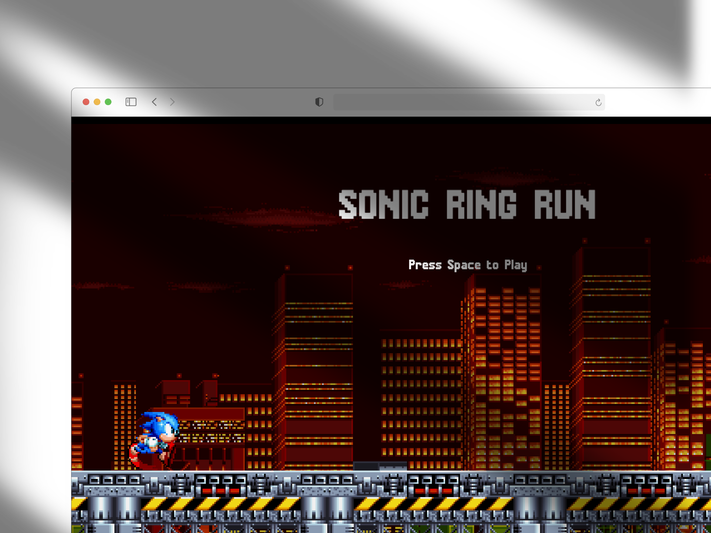

# Sonic with Kaplay

Did this by following [this cool tutorial from JsLegendDev](https://www.youtube.com/watch?v=wfRvhPm5qFc).

I made some small code improvements and made it directly with TS instead of JS.
